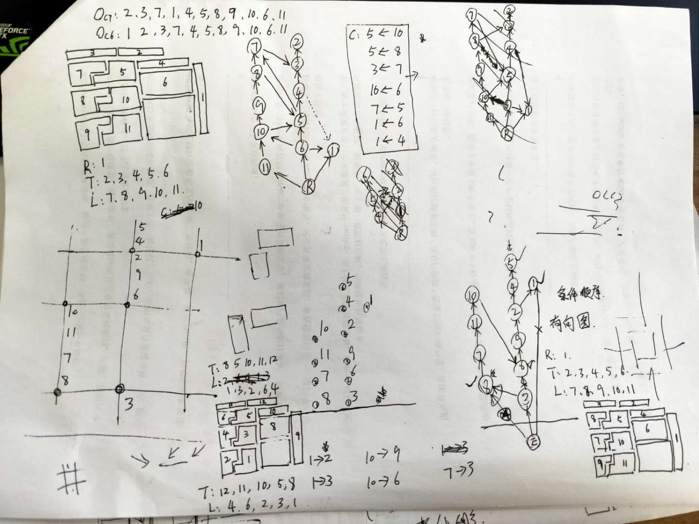
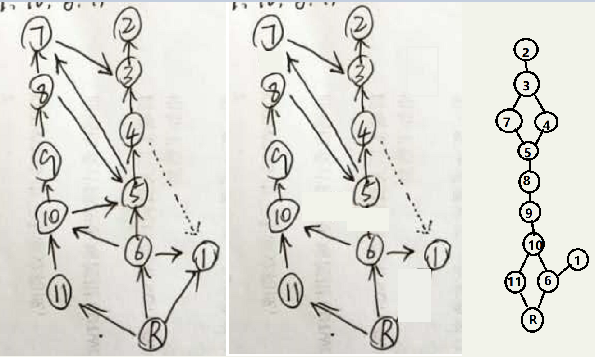

# 拓扑排序 Topological Order 

本项目处理问题：已知若干个序列，序列内的节点已按执行顺序排列，不同的序列的某些节点间也有若干先后顺序；若需要执行完所有的序列的所有节点，每次只能执行一个节点，求一种执行顺序。

## 实际应用实例 1

板块切割问题



如图左上角，该板材加工场景要求周边的板块先切割，面积大的后切割

图中大面积板块右侧，上侧，左侧从外到内希望加工的序列分别为
 + R: 1
 + T: 2, 3, 4, 5, 6
 + L: 7, 8, 9, 10, 11

这3个序列的板块加工，要求不能加工后使其他板块没有了 “依靠”，所以又有限制如下

 + 5 -> 10
 + 5 -> 8
 + 3 -> 7 
 + 10 -> 6
 + 7 -> 5
 + 1 -> 6
 + 1 -> 4

在此情况下，求一个符合限制要求的整体顺序

### 基本思路

 * 首选是选数据结构，如果使用多个数组，在次序变化上变得很不灵活，这里调整顺序经常需要若干节点顺序同时发生改变，而使用有向图最适合该问题场景
 * 如下图，构建一个虚拟节点 R, 将所有顺序逆序后，作为 R 的子节点




 * 将每个条件，作为一个连接关系，加入到图中
 * 若一个节点有多个前节点，如果在前节点之间（A,B...），A 能够到达 B, 则去掉 A 到 本节点的连接
 * 以 R 节点为基础，类似右序遍历收集结点（不重复收集），即得到一种预期的执行顺序
 
### 相关存储结构

为方便遍历等操作，本程序图使用双向多重链表存储图数据

```C++
class LinkListNode {
public:
	int id = 0;
	vector<shared_ptr<LinkListNode>>  preNodes;      //前节点
	vector<shared_ptr<LinkListNode>>  postNodes;     //后节点
};
```

### 测试数据

在具体测试程序中，测试数据对应如下

```C++
	TestCase(
	{
		{ 1 },
		{ 2, 3, 4, 5, 6 } ,
		{ 7, 8, 9, 10, 11 },
	},
	{
		{ 5, 10 },
		{ 5, 8 },
		{ 3, 7 },
		{ 10, 6 },
		{ 7, 5 },
		{ 1, 6 },
		{ 1, 4 }
	})
```

本程序运行结果
```
2 3 7 1 4 5 8 9 10 6 11
```

## 实际应用实例 2

大学的课程安排问题

|课程号|课程名|预修课程|
|---|---|---|
|1|程序设计||
|2|高等数学||
|3|离散数学|2|
|4|数据结构|1,3|
|5|算法设计|1,4|
|6|计算机原理||
|7|线性代数|2|
|8|嵌入式课程|3,6|

课程上课顺序有先后要求，问如何安排课程，给出一种先后顺序

### 测试数据

类似应用实例1的思路，在具体测试程序中，测试数据对应如下

```C++
	TestCase(
	{
		{ 1 } ,
		{ 2 } ,
		{ 3 } ,
		{ 4 } ,
		{ 5 } ,
		{ 6 } ,
		{ 7 } ,
		{ 8 }
	},
	{
		{ 2, 3 },
		{ 1, 4 },
		{ 3, 4 },
		{ 1, 5 },
		{ 4, 5 },
		{ 2, 7 },
		{ 3, 8 },
		{ 6, 8 }
	})
```

本程序运行结果
```
2 3 1 4 5 7 6 8
```

### 相关链接

[某 CSDN 博客文章](https://blog.csdn.net/justinzengTM/article/details/82914740)


